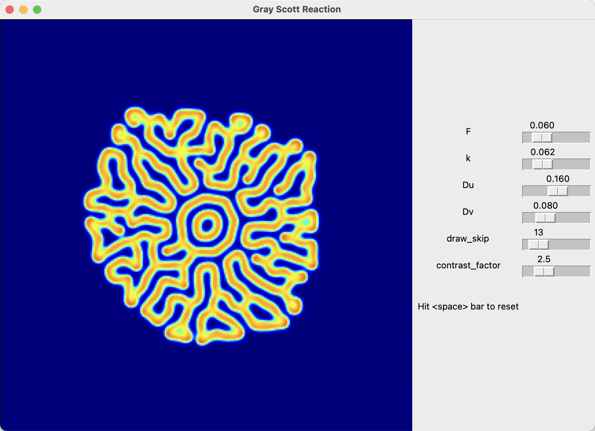
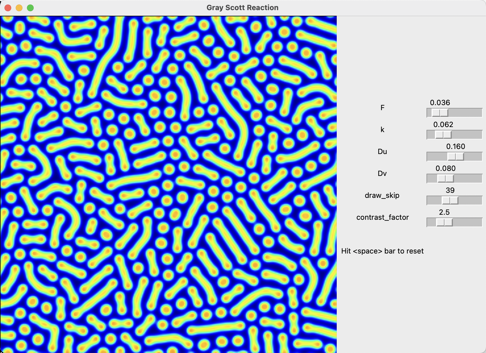
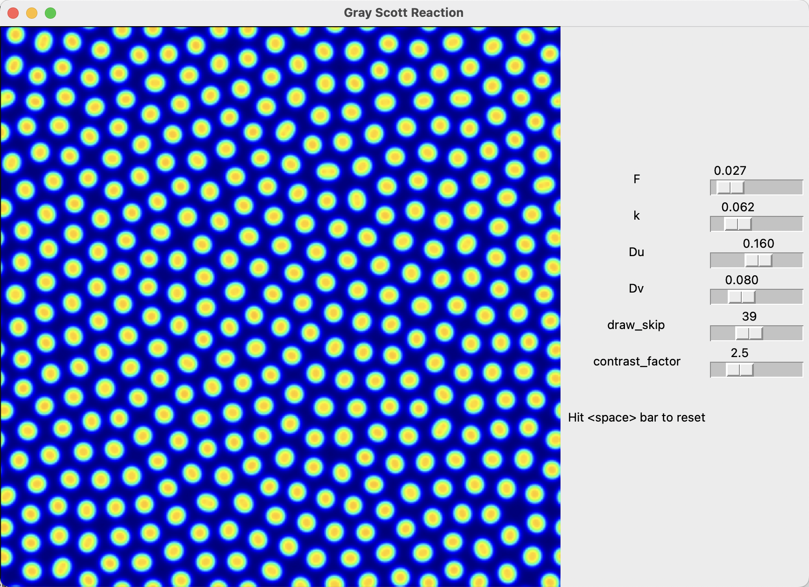

## Gray Scott Model

### Run

Run the simulation in Tkinter gui by:
```bash
python gui.py
```

### Reaction 

$$U + 2V \rightarrow 3V$$

### Rate equations

$$\frac{\partial{u}}{\partial{t}} = D_u \nabla^2 u - uv^2 + F (1-u)$$
$$\frac{\partial{v}}{\partial{t}} = D_v \nabla^2 v + uv^2 - (F + k) v$$

where $u(x, y, t)$ and $v(x, y, t)$ are concentrations of the reactants $U$ and $V$.

In the simulation, discrete laplacian operator is used for diffusion, and $dx$ is set to $1$. Time step $dt$ is important for numerical stability when integrating the PDEs, and it must be set to balance efficiency and numerical stability. A theory for this is [Courant-Friedrichs-Lewy](https://en.wikipedia.org/wiki/Courant%E2%80%93Friedrichs%E2%80%93Lewy_condition).

### Patterns

#### Maze
<p float="left">
  
</p>

#### Solitons
<p float="left">
  
</p>

#### Mitosis
<p float="left">
  
</p>