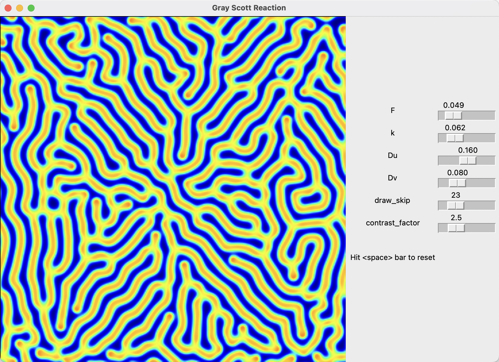

## Gray Scott

#### Reaction 

$$U + 2V \rightarrow 3V$$

#### Rate equations

$$\frac{\partial{u}}{\partial{t}} = D_u \nabla^2 u - uv^2 + F (1-u)$$
$$\frac{\partial{v}}{\partial{t}} = D_v \nabla^2 v + uv^2 - (F + k) v$$

where $u(x, y, t)$ and $v(x, y, t)$ are concentrations of the reactants $U$ and $V$.

In the simulation, concentration $u$ is visualized:
### Maze

  

### Singletons

  

